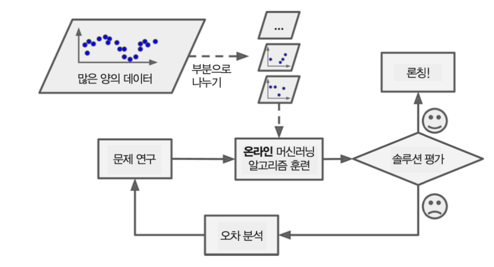

# 한눈에 보는 머신러닝

## 머신러닝이란?
### 정의
  - 명시적인 프로그래밍 없이 컴퓨터가 학습하는 능력을 갖추게 하는 연구 분야

## 머신러닝 시스템의 종류
### 지도 학습과 비지도 학습
- 머신러닝 시스템은 학습하는 동안 사람의 감독 유무나 정보량에 따라 분류 할 수 있음
- 지도 학습, 비지도 학습, 준지도 학습, 강화 학습으로 분류

#### 지도 학습
- 알고리즘에 주입하는 훈련 데이터에 레이블이라는 정답값이 주어짐

- 분류(classification) 작업이 전형적인 지도 학습 작업임
  - ex) 스팸 필터: 많은 메일 샘플과 스팸 유무에 대한 데이터를 통해 새 메일을 스팸인지 아닌지 분류함
- 회귀(regression) 작업도 전형적인 지도 학습 작업임
  - 예측 변수(predictor variable)라 부르는 특정 특성(feature)를 사용해 타깃(target) 수치를 예측함
  - ex) 중고차 가격 예측: 차의 주행거리, 연식, 브랜드 등을 사용해 중고차 가격을 예측함

- 지도 학습 알고리즘 종류
  - K-Nearest Neighbors
  - Linear Regression
  - Logistic Regression
  - SVM(Support Vector machine)
  - Decistion tree, random forest
  - Neural Networks

#### 비지도 학습
- 훈련 데이터에 레이블이 없음, 시스템은 아무런 도움 없이 학습해야 함
- 레이블이 없는 데이터를 학습할 수 있으며, 특정 데이터간 관계를 파악하거나 시각화 하기 위해 사용함

- 비지도 학습 알고리즘 종류
  - 군집(Clustering)
    - K-means
    - DBSACN
    - HCA(Hieracrchical Cluster Analysis)
    - 이상치 탐지(Outlier Detection), 특이점 참지(Novelty Detection)
    - One-Class SVM
    - Isolation Forest
- 시각화(Visualization)와 차원 축소(Dimensionality Reduction)
  - PCA(Principal Component Analysis)
  - Kernel PCA
  - LLE(Locally-Linear Embedding)
  - t-SNE(t-distributed Stochastic Neighbor Embedding)
- 연관 규칙 학습(Association Rule Learning)
  - Apriori
  - Ecalt

#### 준지도 학습
- 데이터를 레이블링 하는 것은 일반적으로 시간과 비용이 많이 들기 때문에 레이블이된 샘플은 적은 경우가 많음
- 준지도 학습은 데이터 중 레이블링이 되어 있는 데이터와 레이블링이 안되어 있는 데이터를 같이 학습하는 경우 사용함

- ex) 구글 포토 호스팅 서비스: 가족사진을 올리면 사람 A와 사람 B를 분류함(비지도 학습 영역), 사람 A와 사람 B에 대한 레이블링 값을 통해 사진에 있는 모든 사람의 이름을 알 수 있음(지도 학습 영역)

- 대부분의 준지도 학습은 지도 학습과 비지도 학습의 조합으로 이루어짐

#### 강화 학습
- 학습하는 시스템 에이전트(Agent)에 대해 환경(Environment)를 관찰하여 행동(Action)을 실행하고 그 결과로 보상(Reward) 또는 벌점(Penalty)를 받음 시간이 지나면서 큰 보상을 얻기 위해 정책(Policy)라고 부르는 최상의 전략을 스스로 학습함.

- ex) AlphaGO: 수백만 개의 게임을 분석해서 승리에 대한 전략을 학습함.

### 배치 학습과 온라인 학습
#### 배치 학습
- 배치 학습(Batch Learning)에서는 시스템이 점진적으로 학습할 수 없으며 가용한 데이터를 모두 사용해 훈련 시켜야함. 일반적으로 이 방식은 시간과 컴퓨팅 리소스를 많이 소모하여 보통 오프라인에서 수행됨
- 시스템을 훈련시키고 그런 다음 제품 시스템에 적용하면, 더 이상의 학습 없이 학습한 것을 단지 적용만 함. 이를 오프라인 학습이라고 함

#### 온라인 학습
- 온라인 학습(Online Learning)에서는 데이터를 순차적으로 한 개씩 또는 미니배치(mini-batch)라 부르는 작은 묶음 단위로 주입하여 시스템을 훈련 시킴.
- 매 학습 단계가 빠르고, 비용이 적게 들어 시스템은 데이터가 도착하는 대로 즉시 학습할 수 있음
 

- 온라인 학습 시스템에서 중요한 파라미터 중 하나는 변화하는 데이터에 얼마나 빠르게 적응할 것인지임, 이를 학습률(Learning Rate)라고 함.
- 학습률을 높게 하면 시스템이 데이터에 빠르게 적응하지만 예전 데이터를 금방 잊어버림
- 학습률을 낮게하면 시스템의 관성이 더 커져 더 느리게 학습됨, 새로운 데이터에 있는 잡음이나 대표성 없는 데이터 포인트에 덜 민감해짐.
- 온라인 학습에서 가장 큰 문제점은 시스템에 나쁜 데이터가 주입되었을 때 시스템 성능이 점진적으로 감소한 다는 점임. 이를 위해 입력 데이터를 모니터링하여 비정상 데이터를 잡아낼 수 있음.

### 사례 기반 학습과 모델 기반 학습
- 머신러닝 시스템은 어떻게 일반화(Generalize)되는가에 따라 분류할 수도 있음.
- 대부분의 머신러닝 작업은 예측을 만드는 것이며 훈련 데이터에서 본 적 없는 새로운 데이터에서 좋은 예측을 만들어야(일반화되어야) 한다는 것임.

#### 사례 기반 학습
- 사례 기반 학습(Instance-based Learning)은 시스템이 훈련 샘플을 기억함으로써 학습하는 방식.
- 유사도(Similarity) 측정을 사용해 새로운 데이터와 학습한 샘플을 비교하는 식으로 일반화함.